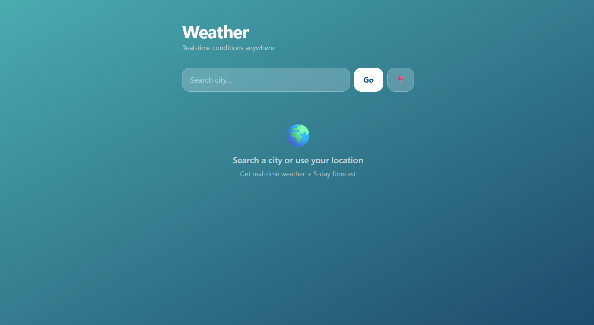

# 🌤️ Weather App
> Real-time weather and 5-day forecast for any city in the world  
> — built with React.js and Tailwind CSS.
 
## 🌐 Live Demo
**[Try the live app →](https://weather-app-pi-liart-11.vercel.app/)**
 
---
 
## 📖 About
A responsive weather application where users can search any city or use their current location to get live weather conditions, a 5-day forecast, humidity, wind speed, and feels-like temperature — all updating instantly without any page reload. Built with React.js and powered by the OpenWeatherMap API.
 
---
 
## 🛠️ Tech Stack
- **React.js (v18)** — Component architecture, hooks, state management
- **Tailwind CSS** — Utility-first responsive styling
- **OpenWeatherMap API** — Live weather and forecast data
- **Vercel** — Deployment and hosting
---
 
## ✨ Features
- Search weather by city name
- Auto-detect location using browser Geolocation API
- 5-day daily forecast
- Celsius / Fahrenheit toggle — no re-fetch
- Dynamic background themes based on weather condition
- Search history — last 5 cities saved in localStorage
- Loading skeleton UI while fetching data
- Meaningful error messages for invalid cities or network issues
---
 
## 📁 Project Structure
```
weather-app/
├── public/
├── src/
│   ├── App.js          # Main app — all components and logic
│   ├── App.css         # Base styles
│   └── index.js        # React entry point
├── .env                # API key (not committed)
├── .gitignore
├── tailwind.config.js
└── package.json
```
 
---
 
## 🚀 Run Locally
 
```bash
# 1. Clone the repo
git clone https://github.com/Ayushi-171/Weather-app.git
 
# 2. Install dependencies
cd Weather-app
npm install
 
# 3. Create a .env file in the root folder
REACT_APP_WEATHER_API_KEY=your_api_key_here
 
# 4. Start the development server
npm start
```
 
> Get your free API key at [openweathermap.org](https://openweathermap.org/api)
 
---
 
## 💡 What This Demonstrates
- Async data fetching with `fetch` API and `async/await`
- Parallel API calls using `Promise.all` for performance
- React hooks — `useState`, `useCallback` for optimized re-renders
- Browser Geolocation API integration
- `localStorage` for persistent search history
- Proper error handling — `res.ok` checks, try/catch, user-facing messages
- Component-based architecture — `WeatherCard`, `ForecastCard`, `SearchHistory`, `StatPill`
- Environment variables for API key security
---
 
## 📸 Preview
 

 
---
 
## 👤 Built By
**Ayushi Swami** —
[Portfolio](https://ayushi-171.github.io/My_Portfolio/) ·
[GitHub](https://github.com/Ayushi-171) ·
[LinkedIn](https://linkedin.com/in/ayushi-swami-aayu)
 